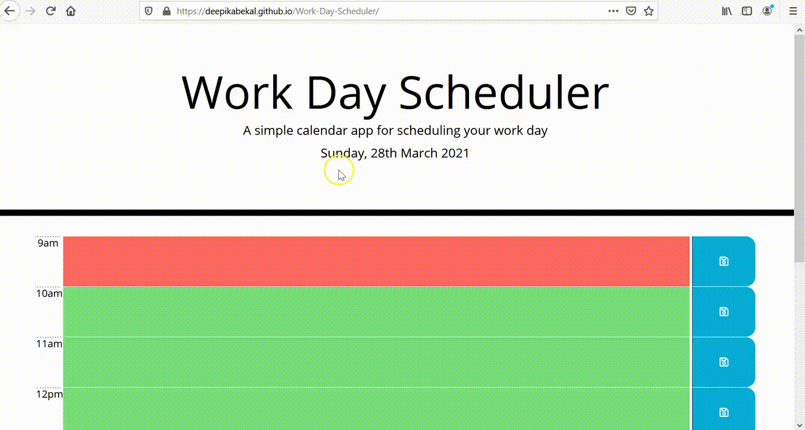

# Work Day Scheduler

[](https://opensource.org/licenses/MIT)

## Description
A work day scheduler that allows the user to add tasks/events for each hour (9am-5pm). This application allows the user to manage time effectively.

## Website
https://deepikabekal.github.io/Work-Day-Scheduler/

## Screenshot


## Technologies Used
* HTML
* CSS
* Javascript

## Libraries
* Moment.js (https://momentjs.com/)
* jQuery (https://jquery.com/)
* Font Awesome (https://fontawesome.com/)
* Google fonts (https://developers.google.com/fonts)

## Contact Info
If any queries please send me an email at deepika.bekal2@gmail.com

## User Story
```
AS AN employee with a busy schedule
I WANT to add important events to a daily planner
SO THAT I can manage my time effectively
```

## Acceptance Criteria
```
GIVEN I am using a daily planner to create a schedule
WHEN I open the planner
THEN the current day is displayed at the top of the calendar
WHEN I scroll down
THEN I am presented with time blocks for standard business hours
WHEN I view the time blocks for that day
THEN each time block is color-coded to indicate whether it is in the past, present, or future
WHEN I click into a time block
THEN I can enter an event
WHEN I click the save button for that time block
THEN the text for that event is saved in local storage
WHEN I refresh the page
THEN the saved events persist
```
## Code Logic
* Time Blocks for displaying each hour from 9am to 5pm
  * A <table> element followed by <tr> element for each time block. Each <tr> element includes 3 <td> elements to display the time, place to enter data and a save icon.
  * Each <td> element where user can enter data has unique id.
* Moment.js .hour() and .moment().format() methods to get the current time in hour and current date.
* Display the current date on the page.
* A for loop to check if the current time is present past or future.
   * If the time displayed in the row is equal to the current time then row will become red (present)
   * Else if the time displayed in the row is less than the current time then the row will become grey (past).
   * Else if the time displaed in the row is greater than the current time the row will become green (future).
* An event listener to detect the user click on the <td> element (place where the user can enter data). The call back function does the following:
   * Get the elements class and id attribute and save in respective variables.
   * Check if there is any text in the field. If yes save it in a variable and if not then store an empty string in the variable.
   * Replace the <td> element with <textarea> element and add the class and id to it.
* An event listener to detect save icon click. The call back function does the following:
   * Get the text in the <textarea> element and save it in a variable.
   * Check if the variable is empty. If yes then send an alert to the user to enter valid data and return from the function.
   * Replace the <textarea> element with <td> element and add the classes and id to it.
   * Call a function to save the data in the local storage.
* A function to save the data to localstorage. It does the following:
   * Get the data from the local storage or an empty array and save it in an array variable.
   * Create an object with key-value pairs for current date, row id and text entered by the user. 
   * Check if the data from the local storage is empty. If not do the following
      * A for loop to iterate through all the items in the array that has the data from the local storage.
      * Inside the for loop, check if the row id already exists in the array. If yes then remove the item from the array. (Replace the old text with the new text saved by the user.)
   * Push the object in to the array that has the data from the local storage.
   * Save the array in the local storage.
* An event listener for window reload. The call back function does the following:
   * Get the date from the local storage and save it in an array.
   * If the array is empty then return.
   * Loop through each row. The call back function does the following:
      * Save the row id in a variable.
      * A for loop to iterate through all the elements in the array.
      * Inside the for loop, check if the row id is equal to the id in the array. If yes then display the text corresponding to the id in the <td> element for the user data and break.

## References
* Study Material for HTML, CSS and javascript provided by Trilogy Education Services.
* www.w3schools.com
* jQuery Documentation (https://api.jquery.com/)
* Stack overflow (https://stackoverflow.com/)
* MDN Web Docs (https://developer.mozilla.org/en-US/docs/Web/JavaScript)
   
